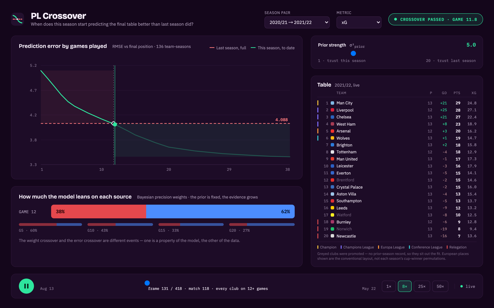

# PL Crossover

When does *this* season start telling you more than *last* season did?

Every August, pundits and models lean on last year's table. At some point in the
autumn that stops being the best available information — the new season has said
enough. This project finds that point, to the game, and lets you watch it happen
as a live-replayable dashboard: standings, a growing RMSE curve, and a Bayesian
weight bar that slides from "trust last season" to "trust this one."

It grew out of a graduate sports-analytics study that measured the same thing at
four checkpoints (games 5, 10, 15 and 20) in a spreadsheet. The web app rebuilds
that analysis on match-level data, at every one of the 38 games, and finds the
crossover exactly rather than bracketing it: **11.8 games**, not "≈12."

It is also a portfolio project built for a Frontend Engineer Intern application —
see [Frontend decisions](#frontend-decisions) for what that means in practice.

**Demo account** (only needed to save named parameter sets — see
[Auth and saved scenarios](#auth-and-saved-scenarios)):

```
email:    demo@plcrossover.dev
password: crossover-demo
```

Seed it into a local `data/pl.db` with `python3 scripts/seed_demo_account.py`
(idempotent — safe to re-run). It is not needed to use the dashboard itself:
replay, charts and the σ tuner are all public.

---

## Status

| | |
|---|---|
| Data pipeline | built, tested |
| Model engine | built, tested, reproduces the original study |
| REST + WebSocket API | built, 75 tests passing |
| React frontend | 7-route dashboard — replay, standings, charts, team/compare/method pages, i18n, demo mode |
| Docker + CI | built |
| Auth + saved scenarios | built end to end — sign in/register, scenarios panel |
| Ask the Model (AI agent panel) | built — cached tool-calling agent on `/model`, see [Ask the Model](#ask-the-model) |

## Quickstart

**Docker (one command, needs the real backend):**

```bash
docker compose up --build
# frontend: http://localhost:5173
# api:      http://localhost:8000
```

The `docker` job in CI builds both images with this exact command, starts
them, and curls the API and the frontend before tearing down — so this claim
is checked on every push, not taken on trust.

**Local dev:**

```bash
python3 -m venv .venv && source .venv/bin/activate
pip install -r requirements.txt
python3 -m uvicorn api.app.main:app --reload   # api on :8000

cd web && npm install
npm run dev                                     # frontend on :5173
```

`data/pl.db` is committed (< 1MB, already built and validated) so neither path
needs a live fetch from Understat to show real data. To rebuild it from scratch:

```bash
python3 scripts/fetch_understat.py     # ~15s, nine seasons
python3 scripts/build_db.py            # -> data/pl.db
```

**Static demo (no backend at all):**

```bash
cd web
npm run demo:data     # freezes data/pl.db into web/public/demo/*.json
npm run build:demo    # vite build --mode demo
npm run preview -- --mode demo
```

A demo mode driven by a frozen frame stream is what lets the frontend deploy as
a static site — nobody runs `docker compose up` to look at a portfolio piece.
`VITE_DEMO_MODE=true` (`.env.demo`) swaps `useReplaySocket` for `useDemoReplay`
at build time (`src/ws/useReplay.ts`); the component tree doesn't know which one
it's using. CI builds and deploys this to GitHub Pages on every push to `main`
(`.github/workflows/ci.yml`).

## Architecture

```
Browser
  ├── REST  ──────────────► FastAPI  ──────► SQLite (data/pl.db)
  │   /api/seasons, /api/pairs/{id}/table, /api/curves, /api/predict
  │
  ├── WebSocket  ──────────► FastAPI  ──────► frame list, built once per
  │   /ws/replay?pair={id}                    pair at startup and cached
  │
  └── Agent tool-calling loop ─► /api/ask ──► get_posterior / get_rmse_curve
      (cached answers today; a live model is a one-line change — see
      "Ask the Model" below)
```

The frontend is seven routes behind a shared sidebar shell (`/`, `/season`,
`/model`, `/teams` + `/teams/:slug`, `/compare`, `/method`, `/scenarios`),
each lazy-loaded (`React.lazy` + `Suspense`) so `/` — the 30-second pitch —
never pulls in ECharts, the biggest chunk in the bundle, just to render a
landing page. `/season` carries the replay dashboard this section's WebSocket
protocol serves; `/model` carries the σ tuner, the per-metric RMSE bars, and
the Ask panel below.

### WebSocket frame protocol

Frames are **pure snapshots, never deltas**, so seeking is just picking an
index. `type: "match"` (380 of them) carries the full 20-row table as of that
instant; `type: "round"` (38 of them, unevenly spaced — see comment in
`api/app/replay.py`) carries all four metrics' current RMSE/MAE/R², the
constant prior baseline, the Bayesian weights, and a `crossover_passed` flag,
so the client never has to compare numbers itself to know when to announce
"⚡ CROSSOVER." 1x plays a frame every 200ms (~80-90s per season); 50x is ~4ms
per frame, which is the actual load the render-decoupling below exists for.

## Auth and saved scenarios

`AuthPanel` and `ScenariosPanel` return nothing under `VITE_DEMO_MODE` — the
static demo has no backend to authenticate against — so this is the one
feature the deployed demo can never show. The GIF below is the real round
trip instead: signing in as the seeded demo account, tuning σ, saving it as a
named scenario, reloading (the access token is gone, the session survives on
the refresh cookie), loading the scenario back, renaming, deleting, and
signing out. It's `e2e/auth-scenarios.spec.ts` itself, recorded —
`RECORD_DEMO=1 npx playwright test e2e/auth-scenarios.spec.ts` inserts a few
beats between steps so the flow is watchable; the assertions are identical to
a normal run.


**The dashboard stays public.** Replay, charts and the σ tuner all work
signed out. Signing in unlocks exactly one thing: naming and saving the
current `(metric, method, prior_weight, obs_variance)` so it can be reloaded
later. There is no login wall anywhere in front of the data.

**Access token in memory on the client, refresh token in an httpOnly cookie.**
Not localStorage — anything that can run JS on the page can read
localStorage, so an XSS payload would walk out with a live session. The
access token lives in a plain module-level variable (`src/auth/tokenStore.ts`)
and is gone on reload by design; a valid refresh cookie silently re-issues one
on mount. The refresh cookie itself is scoped to `/auth`, httpOnly and
same-site, so no JS — injected or not — ever reads it.

**The fetch wrapper refreshes on 401 and retries once, single-flight.** Every
panel on the dashboard can fire a request against an expired access token at
the same moment; without coordination each would race to POST `/auth/refresh`
against the same refresh cookie, and since refresh tokens are versioned
(`token_version`, bumped on logout) rather than usable indefinitely, whichever
refresh lands second would in some designs invalidate the first. One shared
in-flight promise (`src/api/client.ts`) means concurrent 401s trigger exactly
one refresh call; every request waiting on it retries with the same new
token. `src/api/client.test.ts` asserts the call count directly.

**No WebSocket auth ticket.** The spec this was built from calls for issuing
a short-lived, single-use ticket from a REST endpoint (browsers can't attach
an `Authorization` header to a WebSocket handshake) so `/ws/replay` could be
gated per-user. It isn't built: `/ws/replay` streams public replay data with
no per-user state, so there is nothing to gate. If the socket ever needed to
carry account-specific state, the ticket pattern above — or the
`Sec-WebSocket-Protocol` subprotocol, which can also carry a token in the
handshake — is what would gate it; building the endpoint unused would just be
dead plumbing.

## Ask the Model

A question box at the bottom of `/model` — *"Why did predictions get more
accurate after round 12?"*, *"What happens if σ_prior is set to 10?"* — that
answers with real numbers and shows the tool calls that produced them. It
lives on `/model`, not its own route: every preset question is about the
Bayesian blend that page already explains, and the sidebar already carries
seven entries — an eighth for one panel would dilute the nav more than it
would help.

**There is no live LLM call. There is a real agent.** Two tools
(`get_posterior`, `get_rmse_curve` — `api/app/ask.py`) are thin wrappers over
the same `analytics.compute_predict` / `analytics.get_curve` functions
`/api/predict` and `/api/curves` already call, described to a model with real
JSON Schema (`TOOL_SCHEMAS`). `LiveAskSource` is a genuine
`while stop_reason == "tool_use"` loop against the Claude API using that exact
schema — typed, importable, and never instantiated without a real Anthropic
API key. What ships instead, because there is no key and no budget for one,
is `CachedAskSource`: four preset questions, each with a fixed plan of tool
calls, run once against the real `data/pl.db` by
`scripts/generate_ask_fixtures.py` and committed as
`api/app/ask_fixtures.json`. `POST /api/ask` at request time does zero DB
queries and zero model calls in every deployment of this demo, live or
static — it is a pure lookup.

**Swapping to a live model is one line.** `get_ask_source()` in `api/app/ask.py`
picks between the two sources on a single condition — whether `ANTHROPIC_API_KEY`
is set (`Settings.anthropic_api_key`, the standard Anthropic SDK env var, not
this project's usual `PL_`-prefixed ones — it names a third-party credential,
not app config). Set it and every `POST /api/ask` call runs the real loop
above instead of reading the fixture file; nothing else in the router, the
schemas, or the frontend changes.

**Every number in a cached answer is proven reproducible, not just asserted.**
`api/tests/test_ask_fixtures.py` re-executes each fixture's exact recorded
tool calls against the real `data/pl.db` and re-renders the answer text from
the fresh results, then asserts it matches the committed fixture
byte-for-byte. A fixture that drifted from a later change to `model.py`, or a
`data/pl.db` rebuild, would fail this test — the fix is re-running
`scripts/generate_ask_fixtures.py` and committing the diff, not loosening the
assertion. Caught for real once already: an early draft's per-season xG
figures didn't match what `analytics.compute_curve(method="per_season")`
actually returns on the live data (a pre-existing drift between that method
and the coursework's published per-season numbers, unrelated to this
feature and out of scope to fix here) — the fix was dropping that question
rather than shipping a confidently wrong number.

**The streaming is real, the model behind it is not.** The frontend never
receives tokens incrementally — `POST /api/ask` returns the whole cached
answer in one response. `useStreamingText` (`web/src/hooks/`) reveals it a few
characters at a time, batched to at most one `setState` per
`requestAnimationFrame` — the same render-decoupling principle the replay
uses for WebSocket frames, applied to a string instead of a socket. A stop
button actually freezes the reveal (not fast-forwards it), the aria-live
announcer is throttled to whole chunks instead of re-reading the answer on
every character, and the panel never force-scrolls a reader who has scrolled
up to re-read an earlier sentence. Clicking a tool-call chip
(`get_posterior(σ=10)`, its result attached) highlights the panel on `/model`
that call relates to.

If any of this could be mistaken for a live model answering in real time,
that is a bug in the copy, not a design choice — say so and it gets rewritten.

## Frontend decisions

### Design: mockup vs. built

The closest thing a solo project has to "collaborate with designers" is
mocking it up first and building to that. Left, the Figma-first mockup;
right, the built dashboard.

<table>
<tr><td></td>
<td></td></tr>
</table>

`web/public/screenshot.png` above is a full-page capture (1360×1569) — right
for this README, wrong for a link-preview card. Social platforms crop
`og:image` to roughly 1.91:1, so that shot would show whatever 1.91:1 slice
lands in the middle — standings rows, no title, no curve.
`web/public/og-image.png` is a separate, deliberately landscape (1200×630)
crop used only for `og:image` / `twitter:image` in `index.html`, framed to
keep the title and the RMSE curve in the box regardless of where a platform
crops it. Both live under `web/public/` rather than `design/` — an earlier
version symlinked them there, which broke the Docker build: `docker-compose`
builds the `web` image from the `./web` context alone, so a symlink pointing
outside it (`../../design/...`) has no target inside the image, and on a
machine with `core.symlinks=false` (this one) it does not even check out as a
symlink — git materializes it as a plain text file containing the link
target's path string, breaking any consumer even outside Docker. One real
file, in the one place that must have it, dodges both problems.

Four things in the mockup never got built, each dropped on purpose rather than
by running out of time:

- **Shaded regions under the RMSE curve** (before/after the crossover). The
  chart already has a labeled crossover line doing that job; a second visual
  device for the same fact would be decoration, not information — see the
  "one badge, one home" call below for the same reasoning applied to the
  crossover badge.
- **Static G5/G10/G15/G20 reference bars** under the weight panel. Those were
  the four checkpoints the original coursework could compute. The live replay
  already recomputes the real Bayesian weight at every games-played count and
  animates through those exact four values on its way past them — a frozen
  copy of numbers the live bar already passes through exactly would be
  redundant at best, and one more thing to keep in sync at worst.
- **Calendar date endpoints on the timeline** ("Aug 13" / "May 22"). The whole
  reason `team_state` is indexed by games played rather than matchweek is that
  calendar time is *not* the right axis for this analysis — see "Indexing by
  games played, not matchweek" below. Printing season start/end dates on the
  scrubber would quietly reintroduce the axis the model deliberately ignores.
- **The crossover-distinction footnote** ("the weight crossover and the error
  crossover are different events…"). That sentence lives in
  [The model](#the-model) instead. In the mockup it's static caption text; in
  the build the same distinction is *shown* — the RMSE curve and the weight
  bars are two panels that visibly cross at different games-played counts —
  so restating it in prose on the dashboard itself would just be a caption
  explaining what the two panels already demonstrate.

Each entry below is problem → solution → number, in the order they were built.

**Problem: at 50x, a naive `setState` per WebSocket message drops frames.**
`useReplaySocket` mutates a `FrameCache` (plain class, outside React) on every
message and only calls `setState` once per `requestAnimationFrame`, so the
render rate is capped at the display's refresh rate regardless of how fast the
socket delivers — 20 messages/sec at 1x, ~250/sec at 50x, one commit either way.

**Problem: reading that cache during render, through a ref, can tear under
concurrent rendering.** React docs are explicit that a ref's `.current` isn't
safe to read synchronously in a component body. Read it through
`useSyncExternalStore` instead — the primitive built for exactly this shape (an
external, imperatively-mutated source that still needs a consistent read during
render). `FrameCache.getSnapshot` memoizes on `(version, viewSeq)` so it returns
the same object reference between real changes, which `useSyncExternalStore`
requires to avoid re-rendering forever.

**Problem: scrubbing the timeline needs to feel instant, but a fresh jump to an
unplayed part of the season needs the model's full history up to that point,
not just the one frame at that index.** Every frame the socket has ever sent is
kept in the cache. Seeking to an already-seen `seq` is a pure cache read — no
network. Seeking past what's streamed in fetches the gap frame-by-frame
(`{"cmd":"seek","seq":i}` in a loop over the same socket) before committing
state once, so the RMSE curve and weight bars rebuild correctly instead of
jumping straight to a number with no history behind it. Scrubbing *backward*
also correctly hides round frames that are later in the stream than the
scrubbed-to position — the point is watching the model's confidence grow, and
that breaks if scrubbing back reveals the ending early.

**Problem: a refresh loses your place, and there's nothing to share.**
`?week=` mirrors the current round; loading with `?week=15` in the URL
scans forward (silently, via the same seek machinery) until that round has
streamed in, then jumps. `sigma` isn't in the URL yet — no control sets it
until Feature 2 (tunable σ_prior) exists, and an inert query param is worse
than none.

**Problem: the crossover badge appeared twice** — glued onto the "Bayesian
weight" heading and, separately, as a marker on the RMSE curve — reading as a
stray fragment in the first spot. The RMSE curve already shows *where* it
happens (a labeled line at the exact game count); the heading text was
redundant with strictly less information, so it's gone. One badge, one home.

**Problem: the weight bars were drawn in two places** — a static panel tied to
the replay's fixed default prior weight, and again inside "Tune the prior"
tied to whatever the slider was set to — identical at the default and only
diverging once dragged. The static panel is gone; "Tune the prior" is the only
weight-bars panel now, and since it re-fetches on every round the replay
streams in (not just on slider drag), it still animates through the season
exactly like the one it replaced, whenever the slider is left at its default.

**Problem: two standings rows crossing during a FLIP swap were unreadable for
~100ms** — `<tr>` had no explicit background, so mid-animation the two rows'
text painted directly over each other. `transform` already gives each row its
own stacking context (so the later-DOM-order row already paints on top, no
`z-index` needed); it just had nothing opaque to occlude with. Giving every
row `background: var(--panel)` — the same color the table already sat on, so
no visible change outside a swap — turns that overlap into a clean pass
instead of a blend.

**Not built: linked cross-chart highlighting.** The bonus list calls for
hovering a team and having every chart highlight it. None of the three chart
panels carry a team dimension to link against — the RMSE curve, the per-metric
bars and the weight bars are all pooled/aggregate series over all 17 fitted
teams, not per-team series. Only the standings table is per-team. Building the
hover-link would mean adding a team dimension to charts that are aggregate by
design, so it's skipped rather than built and left dangling.

**Bundle size:** 1044KB JS / 347KB gzip total across every chunk
(`npm run build:demo`, the exact build GitHub Pages serves) after
tree-shaking ECharts to just the line/bar charts this app uses
(`echarts/core` + named imports, not `import * as echarts from "echarts"`).
Every route is its own lazy chunk (`React.lazy` + `Suspense`), and the Ask
panel is a second lazy boundary inside `/model` alone: `AskPanel-*.js` is
4.9KB / 1.9KB gzip, and nothing outside `/model` ever fetches it — `/`, the
30-second pitch, loads neither ECharts nor the agent panel's code.

**Lighthouse Performance is 55, measured once, against the real deployed
site** (`npx lighthouse https://lukkasiii.github.io/pl-crossover/`, default
mobile-simulated throttling: 4x CPU, 150ms RTT, ~1.6Mbps): Accessibility 100,
Best Practices 100, SEO 100, and on that one run — First Contentful Paint
4.2s, Largest Contentful Paint 5.0s, Total Blocking Time 640ms, Time to
Interactive 5.2s. Everything below this paragraph is a **separate, local**
experiment run to attribute that number, and its absolute scores are not
comparable to the 55 above — different machine, no real network hop to
GitHub Pages, and (in the final round) two Chrome instances sharing one CPU.
Only the *relative* comparison between arms is meaningful.

Attributing the 55: is it the 932KB unsplit bundle, or autoplay — the season
playing itself the instant the page loads, with a `requestAnimationFrame`
loop and chart re-renders running inside Lighthouse's measurement window on
top of the 2MB (55.8KB gzip) demo-frames fetch? First pass, three sequential
runs per arm (build autoplay-on, measure three times; then rebuild
autoplay-off — landing on the final frame instead, the path
`prefers-reduced-motion` already takes — measure three more): Performance
77/77/88 with autoplay vs. 87/86/81 without, a 9-point gap, with FCP/LCP/SI
each about 1s faster off. That looked like a real effect — until the network
waterfall was checked directly: `frames-1.json` transfers 55.8KB gzip and
finishes at ~250ms unthrottled in every run, on-arm or off, thousands of
milliseconds before LCP fires. It cannot be costing a full second; it isn't
big enough or late enough to reach the metric that supposedly moved.

That contradiction meant the first pass was confounded, not conclusive: the
two arms were measured in separate **sequential blocks** minutes apart (build
→ 3× measure → rebuild → 3× measure), so any drift in the host machine's load
between blocks — thermal state, background processes, a Chrome relaunch —
lands entirely on one arm and reads as an "autoplay effect." Re-run
correctly: both builds served concurrently on separate ports and measured
**interleaved** (on, off, on, off, ×4) so both arms share identical machine
conditions at every point in time:

| | Performance | FCP | LCP | SI | TBT |
|---|---|---|---|---|---|
| autoplay on, interleaved (4 runs) | 62/60/57/57 (med. 58.5) | med. 6.38s | med. 6.62s | med. 6.38s | med. 194ms |
| autoplay off, interleaved (4 runs) | 59/58/60/58 (med. 58.5) | med. 6.38s | med. 6.62s | med. 6.38s | med. 189ms |

Identical medians on every metric. The absolute numbers are worse than the
first pass (two Chrome instances now contending for one CPU), which is
exactly why they're not compared to the 55 above — but the on/off delta,
which is what this experiment exists to measure, collapses to noise once the
confound is removed. **Verdict: autoplay costs nothing measurable; the 55 is
the bundle.** No mitigation needed — the page opens non-empty for free. The
932KB JS / 307KB gzip bundle above is the defensible cause (present, unparsed
and unexecuted, before anything paints, on both arms, every run); the fix is
code-splitting (starting with the Ask panel once it exists), not touching
autoplay.

**Sustained frame rate at 50x**, measured with Playwright driving the same
deployed demo (10 `requestAnimationFrame` samples over 3s while the replay
streams at 50x, so ~250 socket-equivalent messages/sec): **60fps sustained**,
the same as idle — the rAF-buffered render path never drops below the
display's own refresh rate even at the fastest speed, which is the thing the
buffering exists to guarantee.

**Parse time of the 2MB demo frames JSON**, measured in-page (`fetch` +
`JSON.parse` on `frames-1.json`, 2,051,789 bytes, median of 10 runs in headless
Chromium): **~4.3ms**. Small enough relative to a frame budget that it isn't a
stutter risk on its own; the cost that matters is the one-time network fetch,
not the parse.

## The model

`api/app/model.py` is pure functions over numpy arrays — no database, no
framework, no globals — so the maths is testable on its own.

Final league position is regressed on a single predictor, pooled across all
season pairs (17 common teams × 8 pairs = 136 observations). Promoted teams have
no prior-season Premier League record, so they sit out the fit; they are kept in
`pair_teams` with `in_pair = 0` so the UI can grey them out instead of quietly
dropping three clubs from the table.

Two scores are reported side by side:

- **In-sample** — what the original study used. The right answer to "how much of
  final position does this metric explain?"
- **Leave-one-season-out** — refit with one season pair held out, then predict
  it. The right answer to "would this have worked on a season it never saw?"

The second one is not in the original write-up. It is shown next to the first so
the gap is visible rather than assumed away.

The Bayesian view combines both predictors by precision:

```
mu* = (w_prior · mu_prior + w_data · y_bar) / (w_prior + w_data)
w_prior = 1 / sigma²_prior   (fixed — last season does not get more informative)
w_data  = N / sigma²_obs     (grows with games played)
```

Note that the weight crossover and the RMSE crossover are different events: one
is a property of the model, the other a property of the data. The dashboard
plots both.

## Reproducing the original study

`scripts/validate_checkpoints.py` runs the engine over the original checkpoint
spreadsheet and checks it against the ten figures published in the final
presentation. All ten reproduce; see the script for the full table. Held-out
error is only 0.02–0.07 positions worse than in-sample throughout, so the
original conclusions are not an artefact of fitting and scoring on the same 136
rows.

## Tests

```bash
python3 -m pytest api/tests -q   # 75 tests: model, API, auth, replay protocol, Ask fixture reproducibility
cd web && npm run test           # Vitest: FrameCache, zone-band config, auth refresh, streaming reveal
cd web && npx tsc -b && npm run lint
```

The Python suite generates two complete synthetic seasons, runs the real ETL
over them and checks the output holds together: points equal 3W + D, ranks form
an exact 1..20 permutation in every slice, league-wide goals scored equal goals
conceded. Fixtures are written to a temp directory, so a test run can never be
mistaken for real Understat output. `api/tests/test_ask_fixtures.py` is the
odd one out — it skips unless the real `data/pl.db` exists, because it exists
specifically to check the *real* data against the committed cache (see
[Ask the Model](#ask-the-model)), not a synthetic one.

## Self-teaching log

What was new for this project, going in: WebSocket as a two-way protocol
(commands down, snapshots back) rather than a one-shot subscription;
`openapi-typescript` / `openapi-fetch` for generating a typed REST client from
FastAPI's own schema instead of hand-copying interfaces; `useSyncExternalStore`
for reading a ref-based cache safely during render, which came up specifically
because oxlint's `react(refs)` rule caught a ref read that would otherwise have
shipped; Anthropic's tool-calling API shape (`tools` schema, the
`tool_use`/`tool_result` message loop) for the Ask panel's `LiveAskSource`,
learned without ever calling it live.

A real bug found building the Ask panel's streaming reveal, not just a
concept learned: `requestAnimationFrame`'s *rate* isn't the guarantee it
looks like. A `stop()` that only `cancelAnimationFrame`'d the one frame ID a
ref currently pointed at worked in manual testing but not under React
StrictMode's dev-mode double-invoked effects — a second, independent reveal
loop the ref didn't know about kept running to completion past every stop()
call, silently, because each animation frame reschedules itself directly
rather than going back through the effect that could be cancelled. Playwright
driving the built page caught it (a "frozen" answer that kept growing after
the stop button was clicked); the fix was a live generation counter checked
inside every single frame callback, not just once at the top of the effect —
now locked in by `useStreamingText.test.ts`, which fires a stale queued frame
by hand after `stop()` to prove exactly this can't happen again. The same
investigation surfaced that headless Chromium's `requestAnimationFrame` isn't
vsync-paced the way a real display's is (it can fire far faster), so the
reveal now gates advances to real elapsed time, not frame count.

## Getting the data

Understat has no documented API. It used to render the fixture list into the
league page as a hex-escaped JSON blob assigned to `var datesData`; that is what
most scrapers in the wild still look for, and it is gone. The page now ships
nearly empty and the frontend calls an endpoint:

```
GET https://understat.com/getLeagueData/EPL/<year>
X-Requested-With: XMLHttpRequest
```

That header is the whole guard — without it the endpoint returns a 404 HTML
page. The response carries `dates` (380 fixtures), `teams` (per-team 38-match
history with npxG, xpts, ppda, deep) and `players`. The old HTML scrape is kept
as a fallback, so if the endpoint moves the fetcher degrades instead of failing.

## Troubleshooting

**`CERTIFICATE_VERIFY_FAILED: unable to get local issuer certificate`** — the
python.org build of Python on macOS ships without a certificate bundle. Run the
installer's own script once:

```bash
/Applications/Python\ 3.12/Install\ Certificates.command
```

**`no datesData blob found` / a 404 from the endpoint** — Understat changed
something. `scripts/diagnose_fetch.py` fetches one season, saves the raw
response to `data/raw/_debug_page.html`, and reports which extraction patterns
still match. `scripts/diagnose_tls.py` separates a TLS problem from a network
one.

## Indexing by games played, not matchweek

Premier League matchweeks are not aligned in practice — games get postponed and
replayed weeks later, and in 2019/20 the whole season stopped for three months.
The index is each team's own game count, ordered by kickoff time, so `team_state`
holds one row per team per game played: the league table exactly as it stood for
that team at that moment. That table is what the dashboard streams.

## Layout

```
scripts/
  fetch_understat.py         match-level xG, standard library only
  build_db.py                ETL -> SQLite
  export_openapi.py          dumps FastAPI's schema for openapi-typescript
  export_demo_frames.py      freezes the replay into web/public/demo/*.json
  export_ask_fixtures.py     copies the committed Ask fixtures into the demo build
  generate_ask_fixtures.py   runs every preset question against the real db,
                              writes api/app/ask_fixtures.json
  validate_checkpoints.py    regression test against the original study
  seed_demo_account.py       creates/resets the README's demo login
api/
  app/model.py                OLS, leave-one-season-out, Bayesian blend, crossover
  app/replay.py                builds and caches the 418-frame list per pair
  app/ask.py                   tool schemas, the tool-calling loop, cached vs.
                                live agent sources -- see "Ask the Model" above
  app/ask_fixtures.json        committed cache POST /api/ask serves from
  app/routers/                 REST + WebSocket endpoints
  tests/
web/
  src/ws/                     useReplaySocket, FrameCache, URL-state sync
  src/demo/                   useDemoReplay (static-JSON stand-in, same shape)
  src/charts/                 ECharts panels (RMSE curve, metric bars, weights)
  src/components/             standings table, zone bands, timeline, controls
  src/components/AskPanel.tsx  preset questions, streaming reveal, tool-call chips
  src/hooks/useStreamingText.ts  requestAnimationFrame-paced text reveal
  src/auth/                   AuthContext, in-memory token store
  src/components/auth/        sign-in/register panel, saved-scenarios panel
  src/api/client.ts            openapi-fetch client + single-flight 401 refresh
  public/screenshot.png        full-page shot, for this README (real file --
                                not a symlink; see mockup-vs-built above)
  public/og-image.png          landscape crop, for og:image/twitter:image only
data/
  pl.db                       built database (committed, < 1MB)
  excel/                      the original coursework workbooks
  raw/                        fetched match data (gitignored)
design/
  mockup.png                  Figma-first mockup, next to the built result
  auth-scenarios.gif           e2e/auth-scenarios.spec.ts, recorded
```

## Sources

Match-level xG from [Understat](https://understat.com). The original study also
used [FBref](https://fbref.com) for goal difference and final standings; those
are now derived from the match data directly.
